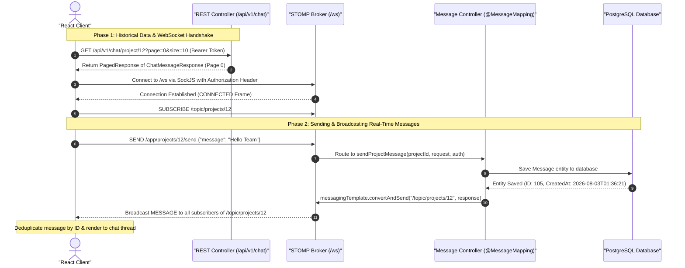

# Complete Real-Time Chat Guide: WebSocket, STOMP & SockJS Integration

This document provides an end-to-end technical explanation and architectural blueprint of the real-time chat collaboration system implemented in the **TeamPilot - AI-Powered Team Collaboration Platform**. It covers why each technology was chosen, how Spring Boot backend handles broker routing and persistence, how the React frontend integrates STOMP with SockJS, and the exact step-by-step data flow.

---

## 1. Core Technology Stack & Why We Use It

Building an enterprise-grade real-time chat app requires a robust, scalable architecture that provides instant bidirectional messaging with automatic network failover.

```
┌─────────────────────────────────────────────────────────────────────────┐
│                           Client (React Frontend)                       │
└────────────────────────────────────┬────────────────────────────────────┘
                                     │ 1. Connect via SockJS + STOMP
                                     ▼
┌─────────────────────────────────────────────────────────────────────────┐
│                    Spring Boot WebSocket Broker (/ws)                   │
├────────────────────────────────────┬────────────────────────────────────┤
│   Inbound Channel Interceptor      │ Auth Verification via JWT Token    │
│   Simple Message Broker (/topic)   │ Broadcast to Subscribers           │
│   Message Controller (/app)        │ Route incoming user messages       │
└────────────────────────────────────┴────────────────────────────────────┘
```

### A. WebSockets

- **What it is**: A persistent, full-duplex TCP connection established via an initial HTTP Upgrade handshake.
- **Why we use it**: Standard HTTP requires the client to repeatedly ask the server for updates (HTTP Polling), which introduces high network overhead and latency. WebSockets allow the server to push messages to the client instantly over a single open TCP connection.

### B. SockJS

- **What it is**: A browser JavaScript library and server-side fallback mechanism.
- **Why we use it**: Some corporate proxies, firewalls, or legacy networks block raw WebSocket TCP upgrade requests. SockJS provides a WebSocket-like API that automatically falls back to HTTP Streaming or HTTP Long-Polling if raw WebSocket connections fail.

### C. STOMP (Simple Text Oriented Messaging Protocol)

- **What it is**: A simple frame-based messaging sub-protocol layered on top of WebSockets (or SockJS).
- **Why we use it**: Raw WebSockets are just an empty transport pipe for bytes/strings without built-in routing concepts. STOMP introduces standardized frames (`CONNECT`, `SUBSCRIBE`, `SEND`, `MESSAGE`) and pub/sub topic destinations (e.g., `/topic/projects/12` and `/app/projects/12/send`), making message routing clean and structured.

---

## 2. Architecture & High-Level Flow



---

## 3. Backend Implementation (Spring Boot)

### 3.1 Broker Configuration (`WebSocketConfig.java`)

Configures the STOMP endpoint and enables the simple in-memory message broker.

```java
package com.ai_powered_app.ai_team_assistant_platform.config;

import org.springframework.context.annotation.Configuration;
import org.springframework.messaging.simp.config.ChannelRegistration;
import org.springframework.messaging.simp.config.MessageBrokerRegistry;
import org.springframework.web.socket.config.annotation.EnableWebSocketMessageBroker;
import org.springframework.web.socket.config.annotation.StompEndpointRegistry;
import org.springframework.web.socket.config.annotation.WebSocketMessageBrokerConfigurer;
import com.ai_powered_app.ai_team_assistant_platform.security.WebSocketAuthInterceptor;
import lombok.RequiredArgsConstructor;

@Configuration
@EnableWebSocketMessageBroker
@RequiredArgsConstructor
public class WebSocketConfig implements WebSocketMessageBrokerConfigurer {

    private final WebSocketAuthInterceptor webSocketAuthInterceptor;

    @Override
    public void registerStompEndpoints(StompEndpointRegistry registry) {
        // Register /ws endpoint for clients to connect; enable SockJS fallback
        registry.addEndpoint("/ws")
                .setAllowedOriginPatterns("*")
                .withSockJS();
    }

    @Override
    public void configureMessageBroker(MessageBrokerRegistry registry) {
        // Topic prefix for server-to-client broadcasts
        registry.enableSimpleBroker("/topic");

        // Application prefix for client-to-server message destinations
        registry.setApplicationDestinationPrefixes("/app");
    }

    @Override
    public void configureClientInboundChannel(ChannelRegistration registration) {
        // Intercept incoming STOMP CONNECT frames to validate JWT tokens
        registration.interceptors(webSocketAuthInterceptor);
    }
}
```

### 3.2 WebSocket Controller (`ChatMessageController.java`)

Handles inbound STOMP messages sent to `/app/projects/{projectId}/send`.

```java
package com.ai_powered_app.ai_team_assistant_platform.websocket;

import com.ai_powered_app.ai_team_assistant_platform.dto.request.SendMessageRequest;
import com.ai_powered_app.ai_team_assistant_platform.service.interfaces.ChatMessageService;
import org.springframework.messaging.handler.annotation.DestinationVariable;
import org.springframework.messaging.handler.annotation.MessageMapping;
import org.springframework.security.core.Authentication;
import org.springframework.stereotype.Controller;

@Controller
public class ChatMessageController {

    private final ChatMessageService chatMessageService;

    public ChatMessageController(ChatMessageService chatMessageService) {
        this.chatMessageService = chatMessageService;
    }

    @MessageMapping("/projects/{projectId}/send")
    public void sendProjectMessage(
            @DestinationVariable Long projectId,
            SendMessageRequest request,
            Authentication authentication
    ) {
        chatMessageService.sendProjectMessage(projectId, request, authentication);
    }
}
```

### 3.3 Message Persistence & Broadcast (`ChatMessageServiceImpl.java`)

Saves the message in PostgreSQL and broadcasts the DTO (`ChatMessageResponse`) over STOMP topic `/topic/projects/{projectId}`.

```java
@Override
public void sendProjectMessage(Long projectId, SendMessageRequest request, Authentication authentication) {
    CustomUserDetails userDetails = (CustomUserDetails) authentication.getPrincipal();
    User sender = userRepository.findById(userDetails.getId())
            .orElseThrow(() -> new ResourceNotFoundException("User not found"));

    Project project = projectRepository.findById(projectId)
            .orElseThrow(() -> new ResourceNotFoundException("Project not found"));

    ChatMessage message = ChatMessage.builder()
            .sender(sender)
            .project(project)
            .message(request.getMessage())
            .edited(false)
            .deleted(false)
            .build();

    chatMessageRepository.save(message);

    ChatMessageResponse response = chatMapper.toChatMessageResponse(message);

    // Broadcast to all clients subscribed to /topic/projects/{projectId}
    messagingTemplate.convertAndSend(
            "/topic/projects/" + projectId,
            response
    );
}
```

### 3.4 Paginated REST Controller (`ChatHistoryController.java`)

Fetches paginated historical messages when the user opens the project chat page or scrolls to the top.

```java
@RestController
@RequestMapping("/api/v1/chat")
public class ChatHistoryController {

    private final ChatService chatService;

    public ChatHistoryController(ChatService chatService) {
        this.chatService = chatService;
    }

    @GetMapping("/project/{projectId}")
    public ResponseEntity<PagedResponse<ChatMessageResponse>> getProjectMessages(
            @PathVariable("projectId") Long projectId,
            Pageable pageable
    ) {
        PagedResponse<ChatMessageResponse> response = chatService.getProjectMessages(projectId, pageable);
        return ResponseEntity.status(HttpStatus.OK).body(response);
    }
}
```

---

## 4. Frontend Implementation (React + Vite)

### 4.1 WebSocket Service Factory (`websocketService.js`)

Encapsulates SockJS and `@stomp/stompjs` client instantiation with JWT Authentication headers.

```javascript
import { Client } from "@stomp/stompjs";
import SockJS from "sockjs-client";

const getSocketUrl = () => {
  const envUrl = import.meta.env.VITE_API_URL;
  if (envUrl) {
    return `${envUrl.replace(/\/$/, "")}/ws`;
  }
  return "http://localhost:1818/ws";
};

export const createStompClient = (topic, onMessageReceived) => {
  const socketUrl = getSocketUrl();

  const stompClient = new Client({
    webSocketFactory: () => new SockJS(socketUrl),
    connectHeaders: {
      Authorization: `Bearer ${localStorage.getItem("accessToken")}`,
    },
    reconnectDelay: 5000,
    onConnect: () => {
      console.log("Connected to STOMP broker at:", socketUrl);
      if (topic) {
        stompClient.subscribe(topic, (message) => {
          if (message.body) {
            try {
              const parsed = JSON.parse(message.body);
              onMessageReceived(parsed);
            } catch (err) {
              onMessageReceived({ content: message.body });
            }
          }
        });
      }
    },
    onStompError: (frame) => {
      console.error("STOMP Error:", frame.headers["message"]);
    },
  });

  return stompClient;
};
```

### 4.2 Reusable Chat Hook (`useChat.js`)

Manages STOMP client lifecycle, connection state, subscriptions, and message publication.

```javascript
import { useEffect, useRef, useState } from "react";
import { createStompClient } from "../services/websocketService";

const useChat = (id, topic, destination) => {
  const [messages, setMessages] = useState([]);
  const [isConnected, setIsConnected] = useState(false);
  const clientRef = useRef(null);

  useEffect(() => {
    if (!id || !topic) return;

    const client = createStompClient(topic, (incomingMessage) => {
      setMessages((previous) => [...previous, incomingMessage]);
    });

    client.onConnect = () => setIsConnected(true);
    client.onWebSocketClose = () => setIsConnected(false);

    client.activate();
    clientRef.current = client;

    return () => {
      if (client) client.deactivate();
      clientRef.current = null;
      setIsConnected(false);
    };
  }, [id, topic]);

  const sendMessage = (message) => {
    if (!clientRef.current || !clientRef.current.connected) {
      return false;
    }
    try {
      clientRef.current.publish({
        destination,
        body: JSON.stringify({ message }),
      });
      return true;
    } catch (err) {
      console.error("STOMP send error:", err);
      return false;
    }
  };

  return { messages, sendMessage, isConnected };
};

export default useChat;
```

---

## 5. Key Frontend Solutions Implemented

### 5.1 Deduplicating Messages (Preventing Double Render)

When sending a message over STOMP, the Spring Boot backend broadcasts the saved `ChatMessageResponse` to `/topic/projects/{projectId}`. Both the sender and recipient receive this broadcast.

To prevent rendering the same message twice, incoming socket messages are filtered by message ID before being appended:

```javascript
useEffect(() => {
  if (socketMessages && socketMessages.length > 0) {
    const latestMsg = socketMessages[socketMessages.length - 1];
    if (latestMsg) {
      const formatted = mapApiMessage(latestMsg, user?.id);
      setMessages((prev) => {
        if (prev.some((m) => m.id === formatted.id)) {
          return prev; // Ignore duplicate
        }
        return [...prev, formatted];
      });
    }
  }
}, [socketMessages, user?.id]);
```

### 5.2 Top-Scroll Infinite Pagination & Scroll Preservation

When the user scrolls to the top of the chat container (`scrollTop <= 30`), page `page + 1` is fetched from `GET /api/v1/chat/project/{projectId}?page={page}&size=10`.

Because backend pagination returns newest messages first in the content array, the array is reversed (older to newer) and prepended. To prevent the scrollbar from jumping abruptly, the previous container `scrollHeight` is saved and restored after DOM update:

```javascript
const loadMoreMessages = async () => {
  if (loadingMore || isLastPage || !projectId) return;
  setLoadingMore(true);

  const container = chatContainerRef.current;
  const previousScrollHeight = container ? container.scrollHeight : 0;

  try {
    const nextPage = page + 1;
    const res = await getProjectMessages(projectId, nextPage, 10);
    const data = res?.data || res;

    if (data && data.content && data.content.length > 0) {
      const chronological = [...data.content].reverse();
      const mappedOlder = chronological.map((msg) =>
        mapApiMessage(msg, user?.id),
      );

      setMessages((prev) => deduplicateMessages([...mappedOlder, ...prev]));
      setPage(nextPage);
      setIsLastPage(data.last);

      // Preserve relative scroll position seamlessly
      requestAnimationFrame(() => {
        if (container) {
          container.scrollTop = container.scrollHeight - previousScrollHeight;
        }
      });
    }
  } finally {
    setLoadingMore(false);
  }
};
```

### 5.3 User Message Alignment (Right vs. Left)

Messages sent by the authenticated logged-in user (`msg.senderId === user?.id`) are aligned to the **right side** using Tailwind CSS flex utilities:

```jsx
const isSelf = msg.senderId === user?.id || msg.isMe;

return (
  <div
    key={msg.id}
    className={`flex gap-3.5 max-w-3xl group ${
      isSelf ? "flex-row-reverse ml-auto" : ""
    }`}
  >
    
    <div className={`space-y-1.5 ${isSelf ? "flex flex-col items-end" : ""}`}>
      <div
        className={`p-3.5 rounded-2xl border ${
          isSelf
            ? "bg-primary-container text-on-primary-container rounded-tr-none"
            : "bg-surface-container-high text-on-surface rounded-tl-none"
        }`}
      >
        <p>{msg.content}</p>
      </div>
    </div>
  </div>
);
```

---

## 6. Summary Flow Diagram

```
[ User Opens Chat ]
       │
       ├─► 1. GET /api/v1/chat/project/12?page=0&size=10  ──► Render Initial Thread
       │
       ├─► 2. Connect /ws via SockJS + STOMP (JWT Auth) ──► Subscribe /topic/projects/12
       │
       ├─► 3. User types message & clicks Send           ──► SEND /app/projects/12/send
       │                                                         │
       │                                                         ▼
       │                                                  [ Spring Boot ]
       │                                                         │
       │                                                         ├─► Save to PostgreSQL
       │                                                         └─► Broadcast to /topic/projects/12
       │                                                                   │
       ├─◄ 4. Receive Real-Time STOMP MESSAGE Broadcast ◄──────────────────┘
       │          │
       │          └─► Check ID (Deduplicate) ──► Append to Chat & Auto-scroll
       │
       └─► 5. User Scrolls to Top (scrollTop <= 30)
                  │
                  └─► GET /api/v1/chat/project/12?page=1&size=10
                            │
                            └─► Prepend Older Messages & Adjust Scroll Position
```
