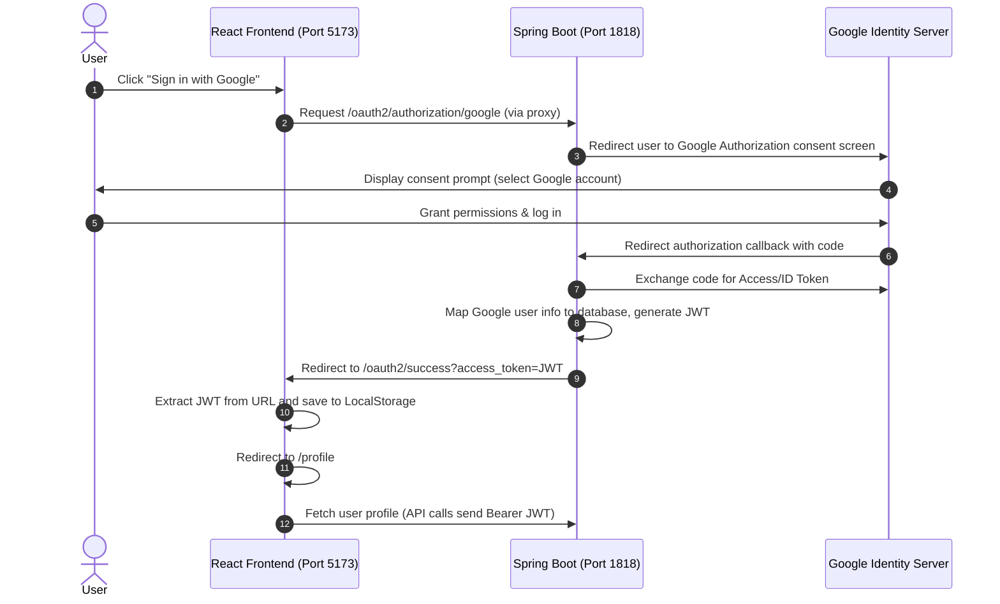

# OAuth2 Google Login Flow - Implementation Documentation

This document explains in simple terms how the Google OAuth2 sign-in system works in our project, covering both the Spring Boot backend and the React frontend, as well as the key issues we resolved.

---

## 1. High-Level Flow Diagram

The diagram below shows how the authentication flow proceeds across the browser, backend, and Google:

---

## 2. Backend Implementation (Spring Boot)

The backend handles the communication with Google, authenticates the user, creates/updates them in the database, and issues our own JWT (JSON Web Tokens) for security.

### A. Security Configuration (`SecurityConfig.java`)
We configure Spring Security to enable OAuth2 login:
- It registers Google as an authorization client using credentials in `application-dev.yaml`.
- It defines `/oauth2/authorization/google` as the starting endpoint.
- It attaches a success handler (`Oauth2SuccessHandler`) that triggers once Google authenticates the user successfully.

### B. OAuth2 Success Handler (`Oauth2SuccessHandler.java`)
Once Google validates the user's account, Spring Security triggers this class:
1. **Extraction**: We extract user details (email, name, picture) returned by Google.
2. **Process Login**: We pass these details to `AuthService` to register the user or retrieve their account.
3. **Generate Tokens**: We generate a short-lived `access_token` (JWT) and a long-lived `refreshToken`.
4. **Cookie & Query Redirect**:
   - The `refreshToken` is set as a secure, HTTP-only cookie.
   - The `access_token` is set as a standard cookie **and** appended to the redirect URL as a query parameter (`?access_token=...`).
   - We redirect the user back to the frontend page: `http://localhost:5173/oauth2/success`.

### C. OAuth2 Service Logic (`AuthServiceImpl.java`)
Under `handleOauth2LoinRequest`:
- We verify if Google marked the email as verified (`email_verified`).
- We check if a user with this email or Google ID already exists in the database.
- If not, we create a new standard member account automatically.
- If they already have a local credentials account, we link their Google profile so they can sign in with either method.

---

## 3. Frontend Implementation (React)

The frontend initiates the login flow, captures the credentials, stores them, and uses them for authorized requests.

### A. Proxy Configuration (`vite.config.js`)
To avoid CORS (Cross-Origin Resource Sharing) blocks, Vite is configured to act as a proxy.
- Any request to `/oauth2/authorization/google` is forwarded to the backend running on `http://localhost:1818`.

### B. Sign-in Redirect Component (`OAuth2Success.jsx`)
This page is mapped to the path `/oauth2/success`. It acts as the landing pad for the login callback:
1. **Extract Token**: Reads the `access_token` from the URL parameters (or fallback cookies).
2. **Save Token**: Saves the JWT to the browser's `localStorage` as `accessToken`.
3. **Clean Up**: Navigates the browser to the `/profile` page, removing the token parameters from the address bar for security.

### C. API Client (`axios.js`)
All communication with the backend is done via a central `axios` instance:
- **Request Interceptor**: Automatically attaches the header `Authorization: Bearer <accessToken>` to every API call.
- **Response Interceptor (Automatic Token Refresh)**: 
  - If an API call fails with `401 Unauthorized` (e.g. access token expired), the interceptor automatically calls `/api/v1/auth/refresh` behind the scenes.
  - The backend reads the HTTP-only `refreshToken` cookie and sends back a new `access_token`.
  - The interceptor saves it to `localStorage` and retries the original API request, creating a seamless experience.

---

## 4. Key Fixes & Design Decisions

### 1. The Cross-Port Cookie Problem (Localhost)
* **Problem**: Initially, the backend set the `access_token` as a cookie on port `1818`, and the frontend on port `5173` tried to read it. Modern browsers block cross-port cookies set during third-party redirects on `localhost` due to strict privacy rules, causing `Access token not found` errors.
* **Solution**: We modified the redirect to pass the `access_token` as a URL query parameter (`?access_token=...`) on the redirect to `/oauth2/success`. The frontend reads this query parameter instantly and removes it from the URL bar upon navigation.

### 2. React Strict Mode Double-Mounting
* **Problem**: In development mode, React Strict Mode mounts every component twice. If we read and clear the cookie on the first mount, the second mount fails because the cookie was already deleted.
* **Solution**: The frontend first checks query parameters, falls back to cookies, and checks `localStorage` to ensure a double mount does not interrupt sign-in.

### 3. Profile Picture Size Constraints
* **Problem**: Google OAuth picture URLs can exceed 255 characters. Since the database column and validation checks were default restricted to 255 characters, Google logins crashed or lost profile pictures.
* **Solution**: We increased the `profileImage` column capacity in `User.java` to `1000` characters, updated `UserUpdateRequest` validator constraints, and updated the frontend validation max-length in `Profile.jsx` to `1000`.

### 4. Circular Dependency Fix
* **Problem**: The backend had a circular dependency cycle between `SecurityConfig` and `AuthService` (both requiring each other's beans).
* **Solution**: We extracted the `PasswordEncoder` definition into a separate `PasswordEncoderConfig.java` configuration class and added `@Lazy` annotation to the `AuthenticationManager` injection in `AuthServiceImpl`.
